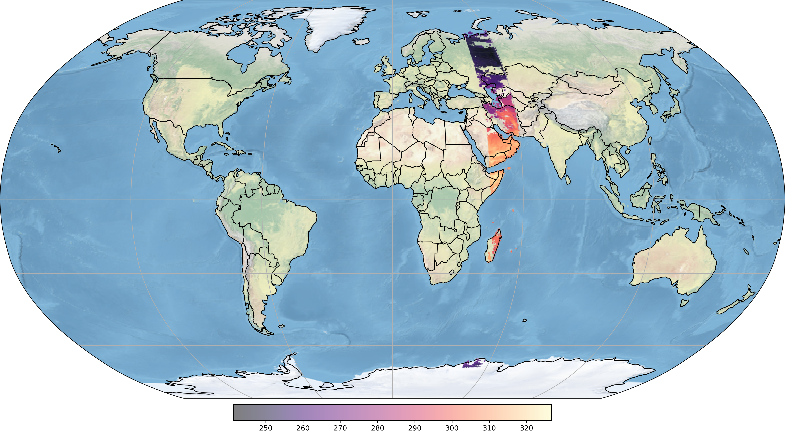

 
# ML4L

Machine learning for land surface modeling.


```
python main.py --process_raw_data --join_era_modis --ML_prep --train_model --predict --evaluate
```


# 1. Raw data

We have two primary sets of data. The first is a selection of [ERA5](https://www.ecmwf.int/en/forecasts/datasets/reanalysis-datasets/era5) fields. These can be thought of as our features or inputs. The second is land surface temperature measurements from [MODIS](https://modis.gsfc.nasa.gov/about/). Both sets of data are provided by ECMWF having undergone some pre-processing and re-gridding, but are generally publicly available.   


## ERA data

The raw ERA data is divided among the following files, all on a reduced Gaussain grid:

* `ERA_sfc`.  Monthly files between 2016-2021, hourly grain.
* `ERA_skin`. Monthly files between 2016-2021, hourly grain.
* `ERA_skt`.  Monthly files between 2016-2021, hourly grain.
* `climateV15`. Selection of constant-in-time features - for example orography - split over multiple files.
* `climateV20`. As above, but more recent version.
* `Monthly lakes`. 12 monthly files describing how lake cover varies month-to-month.
* `Salt lakes`. Single file with time-constant salt lake fraction


## MODIS data

Daily files for [MODIS Aqua](https://aqua.nasa.gov/) day observations between 2016-2021 on an hourly grain. Resolution is 10800 longitude and 5400 pixels latitude (60 pixels per degree). Average LST error is $\le$ 3K. 
See the [User's guide](https://lpdaac.usgs.gov/documents/715/MOD11_User_Guide_V61.pdf) and the original [data product](https://developers.google.com/earth-engine/datasets/catalog/MODIS_006_MYD11A1)


For more details on the raw data, see `Workflow.ipynb`.


# 2. Processing and joining raw data

## Pre-process raw data

To get all this disparate data into a more manageable form call `python main.py --process_raw_data`

This creates:
* Time Variable ERA fields. One file per month
* Time Constant ERA fields. One file per version (V15,V20)

The additional monthly lakes and salt lakes are unchanged by this step. The MODIS files are also untouched.

## Join ERA-MODIS
In order to use the ERA-MODIS data together to train a model, it is necessary to join the data in time and space. That is, given a collection of ERA features at time `t` and grid point `x`, what is the corresponding real world observation provided by MODIS? This is done by the call `python main.py --join_era_modis`.

The general method involves taking an hour of ERA data (which covers the whole globe) and an hour of MODIS data (which covers just a strip) and then using a k-nearest neighbours algorithm to find the nearest ERA grid point for every MODIS point. We filter out any matches where the Haversine distance is > 50 km, and then group by the ERA coordinates to get an average temperature value. The 'nearness' measure is the [Haversine metric](https://en.wikipedia.org/wiki/Haversine_formula). We use [RAPIDS](https://rapids.ai/) for GPU accelerated k-nearest neighbours search. This is built on top of [FAISS](https://github.com/facebookresearch/faiss). One can also use a standard non-GPU knn from [scikit-learn](https://scikit-learn.org/stable/modules/generated/sklearn.neighbors.KNeighborsClassifier.html)

This joining process outputs monthly `parquet` files which hold: `position,time,features,target`. Below is an example of a single hour of joined ERA-MODIS data.    


## Make data ML-ready

`python main.py --ML_prep`

For the purposes of ML it is useful then modify these files via either a 'greedy' or a 'sensible' method:

* **Greedy** involves amalgamating all training data into a single file, all validation data into a single file, etc. We can then load this single file when training, reading into memory only the desired features (`parquet` is column oriented)

* **Sensible** involves converting our `parquet` files into a [TFRecord](https://www.tensorflow.org/tutorials/load_data/tfrecord) format which can then be easily loaded batchwise into an ML pipeline.

For training data of ~ 1 year or less, we typically use `Greedy`. 12 months of data in `.parquet` format is around 3G, and only a subset of that is typically loaded into memory when training (i.e. don't train over all columns). 

At this stage we typically also normalize our features and reassign the V20 climate fields to be "delta fields"; the correction to the V15 value. Similarly `clake_monthly_value` is reassigned to `clake_monthly_value` - `cl_v20`.

---

# 3. Training a model

`python main.py --train_model`

The model training is completely specified via the `config` file. Here a use can set the network structure, batch size, learning rates, loss metric, early stopping patience etc.
In the case that the number of neurons in a hidden layer (`nodes_per_layer`), the default value is `Nfeatures/2`. We take [ADAM](https://arxiv.org/abs/1412.6980) as our standard optimiser. 

Once the training completes, the trained model is saved to disk along with the training history (`training_history.json`) and a complete copy of the config file used for the training (`configuration.json`).


# 4. Making predictions

`python main.py --predict`

Loads a trained model and makes predictions for the data specified in the config.

Outputs latitude/longtude/time/MODIS LST/LST prediction/ ERA skt to `predictions.parquet` in the model directory.


# 6. Evaluating and feature importance


---
